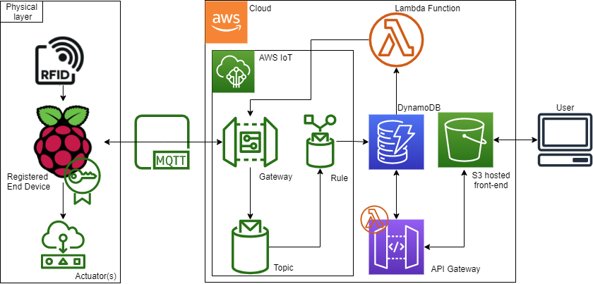
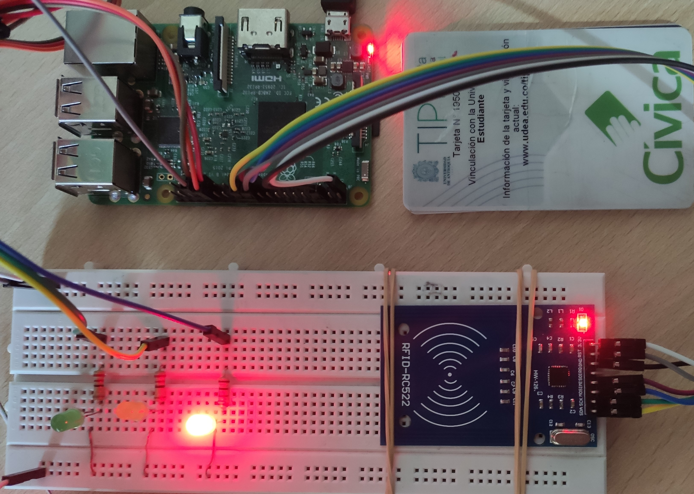

# PI-IoT-Aforo

En este repositorio se encuentra el código fuente del proyecto “Sistema IoT de control de aforos” realizado para la asignatura Proyecto Integrador I

En la carpeta [RPi](./RPi/) se encuentra el código utilizado en el [dispositivo físico](./RPi/pubsub.py)

En la carpeta [AWS-Lambdas](./AWS-Lambdas/) se encuentra el código correspondiente a la lambda que soporta la [API](./AWS-Lambdas/api.js) y la del manejo de [alertas](./AWS-Lambdas/http-iot-alerts.js) hacia los dispositivos físicos

En la carpeta [Documentos](./Documentos/) se encuentra el [informe](./Documentos/IoT_Aforos.pdf), el [poster](./Documentos/Poster.pdf) y el [acta de inicio](./Documentos/Propuesta-del-proyecto.pdf) del proyecto

## Arquitectura del sistema

## Prototipo fisico

